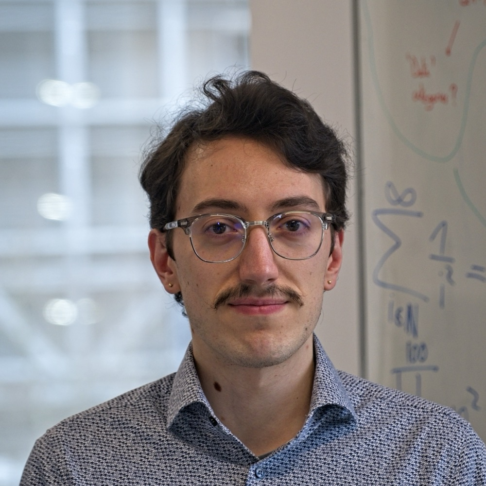

:::: {.grid}
::: {.g-col}
{width=300 style="border-radius: 80%;"}
:::

::: {.g-col}
## PhD Student in Computational Biology

I am a PhD student at the **University Clinics Tübingen**, where I develop probabilistic machine learning methods for spatial Omics data analysis. My research focuses on **Bayesian inference** techniques to model spatio-temporal processes in **glioblastoma**, aiming to uncover the molecular mechanisms driving tumor heterogeneity and progression.

I am co-supervised by [Manfred Claassen](https://claassenlab.github.io/) and [Ghazaleh Tabatabai](https://www.hih-tuebingen.de/forschung/neuroonkologie/forschungsgruppen/fg-tabatabai).
:::
::::

---

## Research Interests

My work bridges **probabilistic machine learning**, **Bayesian statistics**, and **bioinformatics**, with a particular focus on:

:::: {.interest-grid}
::: {.interest-card}
**Probabilistic ML**

Uncertainty quantification in high-dimensional biological data
:::

::: {.interest-card}
**Bayesian Inference**

Hierarchical models and MCMC methods for complex spatial dependencies
:::

::: {.interest-card}
**Bioinformatics**

Spatial Omics and single-cell transcriptomics analysis
:::

::: {.interest-card}
**Spatial Transcriptomics**

Cancer research applications, particularly in glioblastoma
:::
::::

---

## About This Site

This is my personal academic website where I share my research, [publications](publications.qmd), and thoughts on computational methods for biological data.

## Links
- [Email](mailto:marcello.zago.99@gmail.com) - Get in touch
- [LinkedIn](https://www.linkedin.com/in/marcello-zago/) - Professional profile
- [GitHub](https://github.com/MarcelloZago) - Code and projects

